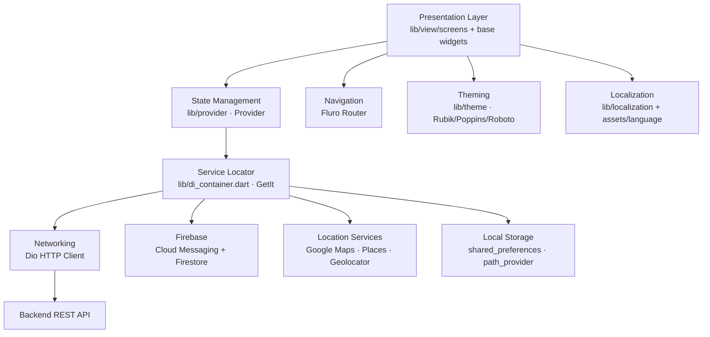

<p align="center">
  
</p>

<p align="center">
  
  
  
  
  
  
  
  
  
</p>

> **Developed by [Arslan Malik](https://github.com/arsalanmaalik461)**
> 📱 WhatsApp: [+92 300 8987448](https://wa.me/923008987448) · 🌐 Website: [arslanmalik.tech](https://arslanmalik.tech)

---

## 🌟 Executive Overview

EFood Restaurant is a complete cross-platform food ordering mobile application built with Flutter. It gives restaurant customers a full ordering journey in one codebase that runs on Android, iOS, and the web: browsing menus and categories, searching dishes, building a cart, applying coupons, checking out, and tracking orders in real time. The UI layer is organized into dedicated screens for onboarding, authentication, home, menu, cart, checkout, orders, tracking, chat, support, and profile, with a service-locator and Provider-based state architecture underneath.

Under the hood the app is engineered as a production-style client: networking goes through a Dio HTTP client, push notifications are wired via Firebase Cloud Messaging with local notification display, and location features — address picking, delivery address search, and order tracking on a map — run on Google Maps, Places autocomplete, geocoding, and geolocation services. State is managed with Provider, dependencies are resolved with GetIt, and navigation uses the Fluro router, so the code follows patterns that scale to a real backend team and multiple app flavors.

The project is also web-ready (Flutter web scaffolding plus Firebase hosting configuration), ships with multi-language localization support, and packages themed typography (Rubik, Poppins, Roboto) with bundled image and language assets. Everything you need to build, configure, and extend it is documented below.

---

## 📑 Table of Contents

- [✨ Key Features & Highlights](#-key-features--highlights)
- [🖥️ Feature Showcase](#️-feature-showcase)
- [🏗️ System Architecture](#️-system-architecture)
- [🚀 Quickstart & Installation Guide](#-quickstart--installation-guide)
- [📂 Project Structure](#-project-structure)
- [🛡️ Security & Notes](#️-security--notes)

---

## ✨ Key Features & Highlights

| Feature | Description |
| :--- | :--- |
| 🍔 Menu & Category Browsing | Browse dishes by category, view popular items, and explore combo set-menus from dedicated menu and category screens. |
| 🔎 Smart Search | Typeahead search screen for quickly finding dishes and restaurants as you type. |
| 🛒 Cart & Checkout | Full cart management with coupon/discount support and a guided multi-step checkout flow. |
| 📦 Order Tracking | Track orders live on a map with a countdown timer for delivery ETA. |
| 🔐 Authentication & OTP | Login, registration, and forgot-password flows with PIN-code OTP fields and international country-code phone input. |
| 🗺️ Maps & Address Management | Pick delivery addresses with Google Maps, Places autocomplete, geocoding, and device geolocation. |
| 💬 In-App Chat & Support | Built-in chat and support screens for customer communication and help requests. |
| ⭐ Reviews & Wishlist | Product review screens and a wishlist for saving favourite dishes. |
| 🔔 Push Notifications | Firebase Cloud Messaging integration with local notification rendering for order updates and offers. |
| 🌍 Multi-Language Support | Localization-ready with a language selection screen and bundled language assets. |
| 🎨 Themed UI | Custom app theme with Rubik, Poppins, and Roboto fonts, shimmer loading states, and carousel banners. |
| 📱 Cross-Platform | One Flutter codebase targeting Android, iOS, and web, with Firebase hosting config included. |

---

## 🖥️ Feature Showcase

### 1. Ordering Flow — Home, Menu & Cart

> "Browse categories, search dishes, and build an order in a few taps."

- Home screen with promotional carousel banners and popular-item listings
- Category and menu screens with dish browsing, plus set-menu (combo) offerings
- Cart screen with quantity management, coupon application, and checkout handoff

### 2. Order Lifecycle — Checkout, Payment & Tracking

> "From address selection to live delivery tracking."

- Checkout flow with delivery address selection powered by Google Maps and Places autocomplete
- Order placement with a countdown timer showing preparation/delivery progress
- Live order tracking rendered on a map with geolocation support

### 3. Account & Engagement — Auth, Chat & Notifications

> "Accounts, support, and real-time updates in one place."

- Onboarding, welcome, and splash screens leading into login/register with phone OTP verification
- In-app chat and support screens, profile management, and notification centre
- Wishlist, product reviews, language switching, and offline connectivity awareness

---

## 🏗️ System Architecture



---

## 🚀 Quickstart & Installation Guide

### Prerequisites

- [Flutter SDK](https://docs.flutter.dev/get-started/install) installed (project targets Dart SDK `>=2.7.0 <3.0.0`)
- An Android emulator / iOS simulator or a physical device with USB debugging
- A Firebase project with Android/iOS apps registered (for push notifications)
- A Google Maps API key with Maps SDK, Places API, and Geocoding API enabled

### Step-by-Step Installation

```bash
# 1. Clone the repository
git clone https://github.com/arsalanmaalik461/EFood-Restaurant.git
cd EFood-Restaurant

# 2. Fetch dependencies
flutter pub get

# 3. (Optional) Generate/refresh platform files if needed
flutter create --platforms=android,ios,web .

# 4. Configure API endpoints and keys
#    - Update the base URL constants in lib/utill and lib/data
#    - Add your Google Maps API key in android/app/src/main/AndroidManifest.xml
#      and ios/Runner/AppDelegate / Info.plist
#    - Place google-services.json (Android) and GoogleService-Info.plist (iOS)
#      if you use Firebase push notifications

# 5. Run the app
flutter run

# 6. Build a release APK / app bundle
flutter build apk --release
flutter build appbundle --release
```

> **Note:** The exact API base URL and keys live in the app's config/util files (`lib/utill`, `lib/data`) — point them at your own backend before building for production.

---

## 📂 Project Structure

```
EFood-Restaurant/
├── android/                 # Android platform project
├── ios/                     # iOS platform project
├── web/                     # Flutter web scaffolding
├── lib/
│   ├── main.dart            # App entry point
│   ├── di_container.dart    # GetIt dependency-injection setup
│   ├── generated/           # Generated plugin registrant
│   ├── data/               # Data layer (models, repositories, API clients)
│   ├── provider/           # Provider state-management classes
│   ├── view/
│   │   ├── base/           # Reusable base widgets
│   │   └── screens/        # Feature screens:
│   │       # address, auth, cart, category, chat, checkout, coupon,
│   │       # dashboard, forgot_password, home, html, language, menu,
│   │       # notification, onboarding, order, popular_item_screen,
│   │       # profile, rare_review, search, setmenu, splash,
│   │       # support, track, update, welcome_screen, wishlist
│   ├── helper/             # Helper utilities
│   ├── localization/       # Multi-language localization
│   ├── theme/              # App theme and styling
│   └── utill/              # Constants, API config, utility functions
├── assets/                 # Icons, images, language files, JSON data
├── test/                   # Widget/unit tests
├── public/                 # Firebase hosting public assets
├── firebase.json            # Firebase hosting configuration
├── .firebaserc              # Firebase project aliases
├── pubspec.yaml             # Dependencies and asset declarations
└── README.md
```

---

## 🛡️ Security & Notes

- **API keys:** Never commit real Google Maps, Firebase, or backend API keys to a public fork — rotate any key that has ever been pushed to this repository.
- **Backend dependency:** The app is a client; it requires a running backend API (base URL configured in `lib/utill` / `lib/data`) for menus, orders, and auth to function.
- **Permissions:** Location, camera (image picker), and notification permissions are requested at runtime — verify each permission prompt matches your store listing's privacy disclosures.
- **Firebase:** `firebase.json` / `.firebaserc` reference a Firebase project for hosting and push; re-point them to your own project before release builds.
- **No analytics by default:** There is no third-party analytics/tracking SDK in the dependency list — add your own if you need usage metrics.
- **License:** No license file is present in the repository. Treat the code as all-rights-reserved unless the owner adds one.

---

<p align="center">
  <sub>Developed with ❤️ by <a href="https://github.com/arsalanmaalik461">Arslan Malik</a> · 📱 <a href="https://wa.me/923008987448">WhatsApp: +92 300 8987448</a> · 🌐 <a href="https://arslanmalik.tech">arslanmalik.tech</a></sub>
</p>
